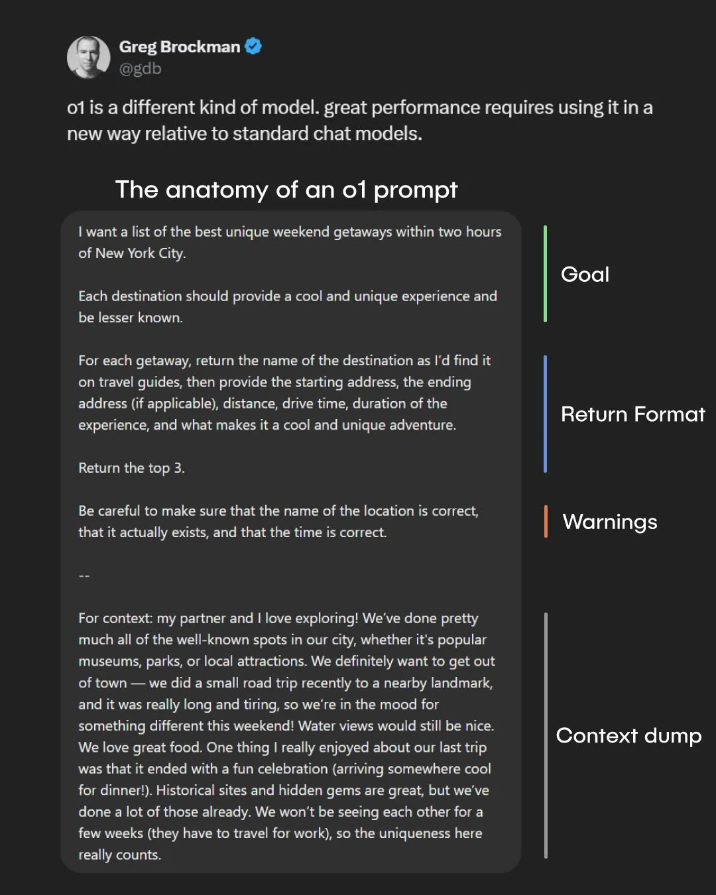
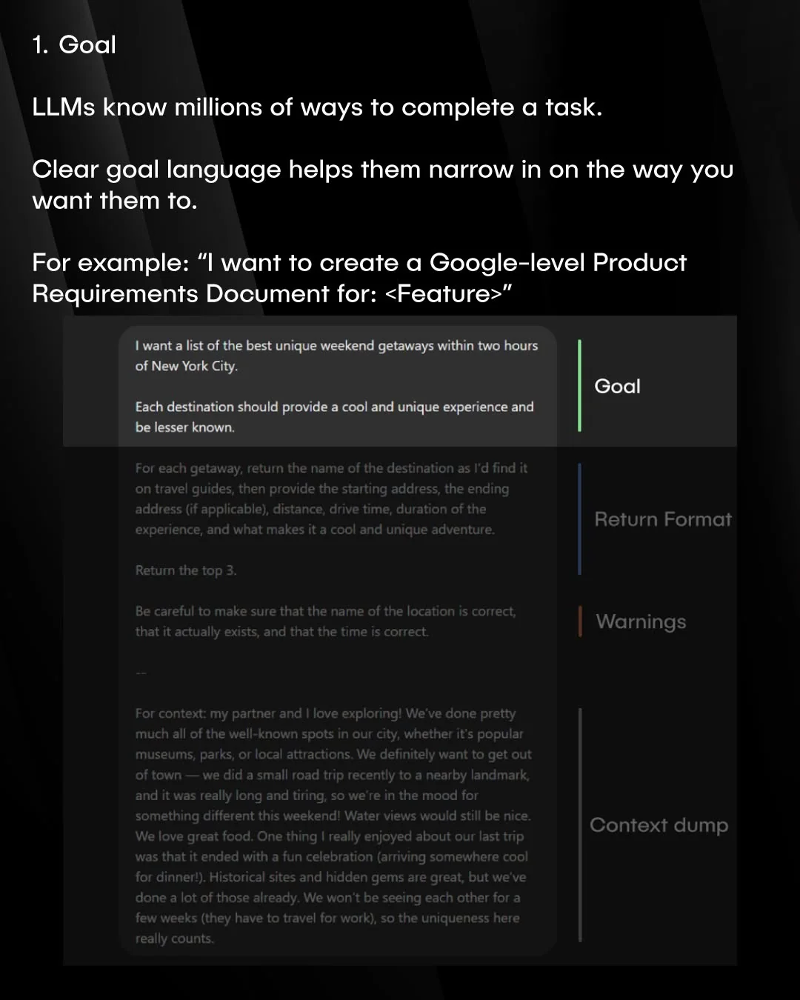
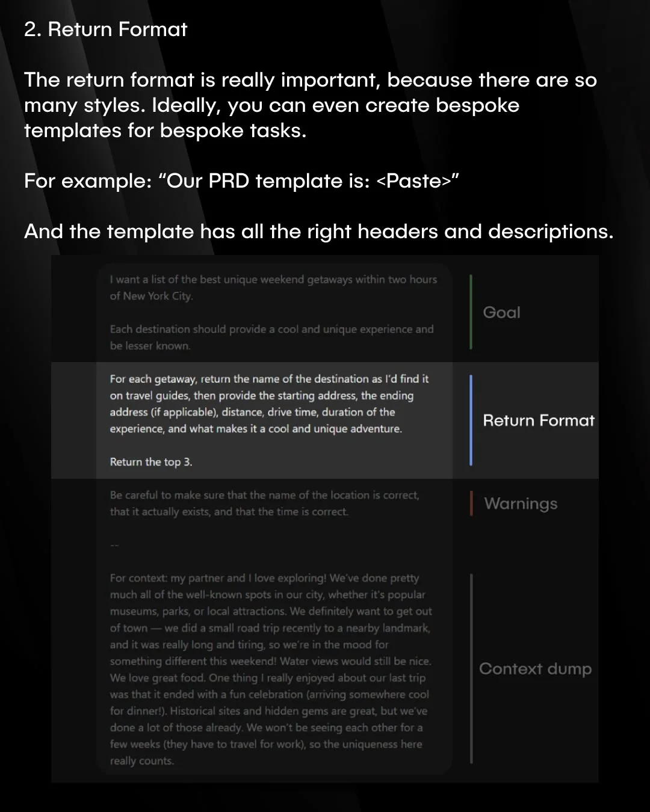

# This domain might be for sale
It appears I don’t have time for this project—at least, not right now. Until I can revisit it, I’d consider selling this domain if there's serious interest. Feel free to reach out, and we can discuss further.

* [Contact](https://forms.gle/mY8hEZzCsRvt63hZ6)

# The anatomy of an o1 prompt

  
  
  
  
  

[Source](https://www.reddit.com/r/GenAI4all/comments/1ize35b/most_people_are_still_prompting_wrong_openai/)
